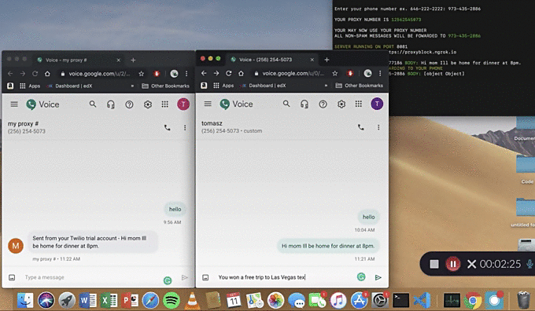

# ProxyBlock

ProxyBlock is a machine learning integrated spam filtering application that supplies a user with a proxy phone number that they can give out to high-risk contacts like (stores, websites and unknown contacts). The application works with actual phone numbers by forwarding non-spam messages to the user’s actual phone and blocks all other incoming spam SMS messages using a given proxy phone number.

### Ok's legitimate messages

### Rejects spam

## Installation

Download the repository into the desired directory create a separate python environment using virtualenv.

`virtualenv -p python3 <desired-path>`

Activate the virtual environment and cd into ml_model folder and run:

`pip install -r requirements.txt`

Once all python dependencies are installed return to ProxyBlock main directory and install all node packages using:

`npm install`

Once all modules are installed create a .env file and supply the following information

  

NGROK_TOKEN = REPLACE_WITH_NGROK_TOKEN

PROXY_NUMBER = REPLACE_WITH_PROXY NUMBER

TWILIO_SID = REPLACE_WITH_TWILLIO_SID

TWILIO_TOKEN = REPLACE_WITH_TWILLIO_TOKEN

  

## Aditional requirements

  

- Sign up for Ngrok and generate a tunnel

- A phone number needs to be generated in the Twilio account. Assigned a webhook address created on the Ngrok website.

- Twilio SID and TOKEN are in the Twillio console page

- Any number that you want to test this functionality with needs to be whitelisted in the Twilio API this is a limitation of the trial account.

  

## Usage

  

To start the program after all the steps above have been completed run.

  

`node server.js`

  

Enjoy!
